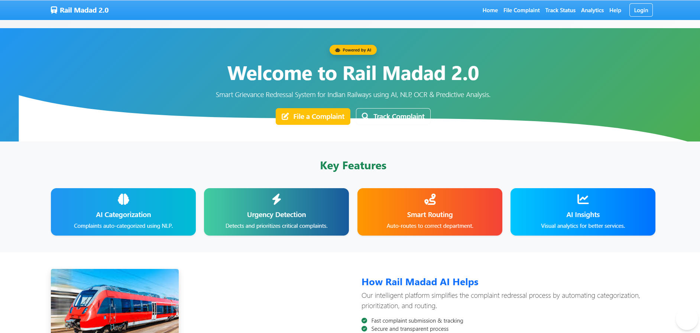
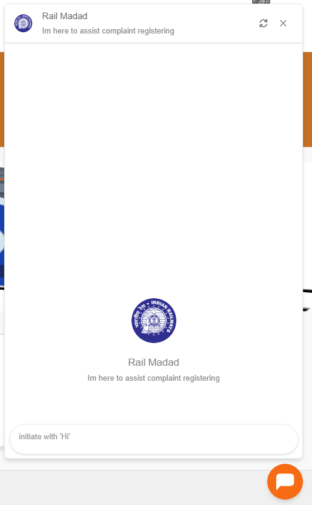

# 🚆 Rail Madad 2.0 – AI-Powered Grievance Redressal System for Indian Railways

Rail Madad 2.0 is an advanced, AI-enhanced grievance redressal system built to modernize complaint handling for Indian Railways. This version is a complete redesign of the original project, incorporating AI for smart complaint categorization, priority detection, and intelligent routing to the right departments.

> 📌 *"Empowering faster resolutions, smarter classification, and better passenger satisfaction."*

---

## ✨ Features

- 🤖 **AI-Based Complaint Categorization** using NLP & ML
- ⏱️ **Urgency Detection & Prioritization**
- 🔄 **Smart Complaint Routing** to concerned departments
- 🖼️ **Image & Video Analysis** using OpenCV + TensorFlow
- 🔍 **OCR Text Extraction** with Tesseract
- 💬 **Dialogflow Chatbot** for auto-complaint registration
- 📊 **Admin Dashboard** for complaint tracking and insights
- 🌐 **Responsive Frontend** using Bootstrap, HTML, CSS, and JavaScript

---

## 🏗️ Tech Stack

| Layer      | Technology |
|------------|------------|
| **Frontend**  | HTML5, CSS3, Bootstrap 5, JavaScript |
| **Backend (Planned)** | Django (Python) |
| **AI/ML**   | TensorFlow, OpenCV, Scikit-learn, NLTK, Dialogflow |
| **OCR**     | Tesseract, PyTesseract |
| **Database** | SQLite / PostgreSQL (planned) |

---

## 📸 Screenshots

| Homepage                            | Chatbot for assistance |
|-------------------------------------|-------------------------------------|
|   |  |

---

## 🚀 How It Works

1. **User files a complaint** via a simple form or chatbot.
2. **AI model classifies** the complaint category using NLP.
3. **Urgency score** is calculated to prioritize serious issues.
4. **Image/video evidence** is analyzed for further context.
5. Complaint is **routed automatically** to the relevant department.
6. **Admin dashboard** shows real-time updates and analytics.

---

